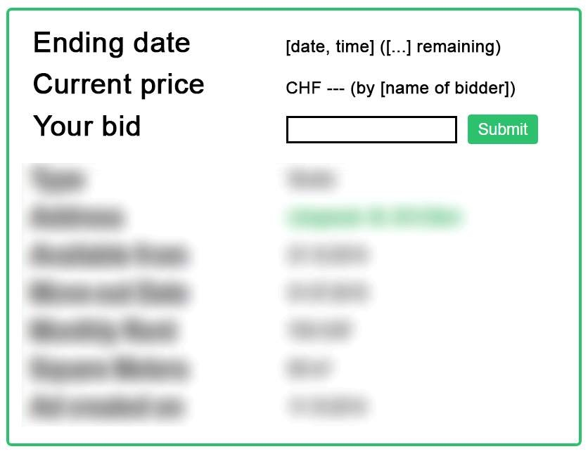

Software Requirement Specification
==================================

1. Introduction
------------
### 1.1 Purpose
This SRS is for the use of the developers and the customer of the Flatfinder application. The content declares the specification of the project which have to be uphold by the customer and the developers.
### 1.2 Stakeholders
This Software Project will be developed for the ESE/SCG group of the University of Bern. They will have all the rights of the the code and the publishing.
### 1.3 Definitions
Ad: Advertisement
SW: Software

Status:
* I: Implemented
* PI: Partially Implemented
* NI: Not Implemented

Main actor
* LIU: Logged in user
* NLIU: Not logged in user

### 1.4  Overview
Chapter 2 displays the customer specifications and wishes important for this project.
Chapter 3 is targeted to the developers and shows the specific requirements.
### 1.5 References
This specification references to the follwing link where all the tasks are listed: 
[Link to the Project description page on github](https://github.com/scg-unibe-ch/ese2016/wiki/Project-Description "Github ESE Project Description Homepage")
## 2. Overall description
-------------------
### 2.1 Use cases
The following section describes the behaviour of the FlatFindr Application. This should provide a high-level overview of the use cases and give an impression about its main conceptual ideas. The use cases are grouped as follows: 
1. User Management
2. Publish Ads
3. Advertisements in General (open, display, bookmarks etc.)
4. Searching and Displaying Ads
5. Alerts
6. Visitations
7. Messaging with Advertiser

#### 2.1.1 User Management
The following section provides an overview of the basic behavior of becoming a member of FlatFindr.

| Title                              | Description                      | Priority |
|:--- |:-----------------------------------|:---------------------------------|:---------|
| Users without account can sign up  | **Trigger** User clicked on 'Sign up' Link which is found in top right corner  **Expected** User has selected 'Login' in menu bar on home screen and afterwards selected 'Sign Up' on login page. Registration page opens where user can enter his personal information to create an account.  **Main Actor** NLIU                                     | HIGH |
| Log in     |**Trigger** User clicked on 'Login'-button found in top right corner.   **Expected** On login page, the user can enter his e-mail address and password. Expected behavior: User is logged in, user menu has changed.  **Main Actor** NLIU                                                                               | HIGH |
| Logged in users can logout        |**Trigger** User clicked on 'Log out'-button in top right corner.  **Expected** User can select logout in the menu. Afterwards, he is logged out of the application i.e. does not have member privileges anymore.  **Main Actor** LIU                                  | HIGH |
| Users can edit the profile      |**Trigger** User opened the menu and lcicked on 'Public profile', then 'Edit Profile'.  **Expected** User can change his personal information through a standard form.  **Main Actor** LIU                                                                                     | LOW |
| Users can access public profiles |**Trigger** In visitor list, user clicked on 'Visit' button.  **Expected** Member can see the public profile of the other member. Visible information are the username (e-mail address), the name and the personal description (About me).  **Main Actor** LIU                                                                                      | LOW |

#### 2.1.2 Publish Flat Ads
The following section provides a high-level overview of how to publish a flat ad in the FlatFinder application. 

| Title                              | Description                      | Priority |
|:-----------------------------------|:---------------------------------|:---------|
| Logged in users can publish ads            | **Trigger**<ul><li>'Publish Ads' in menu bar selected</li></ul>**Expected** A member can publish flat ads. In the publishing form, the user has to fill in various information which are required to publish the ad.  **Sections** General info <ul><li>Ad Title</li><li>Street</li><li>City / Zip code</li><li>Move-in date (rent only)</li><li>Move-out date (rent only)</li><li>Price per Month (rent only)</li><li>Starting price (auction only)</li><li>Auction ending date (auction only)</li><li>Direct-buy price (direct sell only)</li><li>Square meters</li><li>Type [Room, Studio, Property]</li><li>Offer Type [Rent, Direct sell, Auction]</li></ul>Room Description<ul><li>Characteristics</li><li>Room Description (free text)</li></ul>Preferences (Optional, rent only)<ul><li>Preferences (free text)</li></ul>Pictures (Optional)<ul><li>Picture upload</li><li>Picture overview and option to delete</li></ul>Visiting times (Optional)<ul><li>Visiting times, to- and from times</li></ul> **Main Actor** LIU                                                 | HIGH |
| Edit ads                          | **Trigger**<ul><li>'Edit ad' in 'My rooms' clicked</li></ul>**Condition to show**<ul><li> Member has a published ad</li></ul>**Expected** The user can modify an ad. Functionality is similar to use case above.   **Main Actor** LIU                                           | MID |

#### 2.1.3 Advertisements in General (open, display, bookmarks etc.)
The following section provides an overview of the handling of ads once they are published i.e. the displaying, different tools to manage the ads etc. 

| Title                              | Description                      | Priority |
|:-----------------------------------|:---------------------------------|:---------|
| Open ads from home page         | **Condition to show**<ul><li> at least one ad on landing page </li><li> user selecting the title of the ad</li></ul> **Expected** The flat page opens showing all the details and information provided by the advertiser during publishing of the ad.    **Main Actor** LIU, NLIU                             | MED |
| Show advertiser on ad page           | **Condition to show**<ul><li> opened ad page</li></ul> **Expected** On the bottom of the ad page, the advertiser himself is shown. Logged in users can visit the profile of the advertiser and contact him. Non-logged in user can only see the username.     **Main Actor** LIU, NLIU | LOW |
| Bookmark ads / Remove bookmarks                         | **Condition to show**<ul><li> opened ad page</li><li>Visitor is not the Advertiser of the ad</li></ul> **Expected** On top of the ad page next to the tile, the user can select "Bookmark Ad" to remember the ad. The ad will then be display in the menu 'My Rooms' in the section 'My bookmarks.' By clicking again (where it now says "Bookmarked"), the bookmark is removed.  **Main Actor** LIU | LOW |
| Show own ads        | **Condition to show**<ul><li>Published at least one ad</li></ul> **Expected** All the published ads of a member are shown in the menu 'My Rooms' under the section 'My Advertisements'.   **Main Actor** LIU    | LOW |

#### 2.1.4 Search and Display Ads
The following section provides a high-level overview of the different search functionalities provided to find the right flat. 

| Title                              | Description                      | Priority |
|:-----------------------------------|:---------------------------------|:---------|
| Searching for a flat/ad             | **Expected** Search page opens where user can set different search criterias (including the option to search for properties to be sold).   **Main Actor** LIU, NLIU                                                     | HIGH |
| Advanced Searching for a flat/ad             | **Expected**  The advanced Search page opens below the normal search entry fields. So, an 'Extended Search'-section is now available similar to the search criterias earlier found at the filter criterias.  **Main Actor** LIU, NLIU                                                     | HIGH |
| ~~Create an alert off a search~~         |~~**Expected**~~ ~~A new alert can be created by clicking a button near the search criterias.~~  ~~**Main Actor**~~ ~~LIU~~ | ~~LOW~~ |
| Filter the results                 |**Expected** Next to the list view of the search results, there is a tool for filtering the results with different criterias.  **Main Actor** LIU, NLIU                                                                                  | MED |
| Sorting the results                 |**Expected** Above the list view of the search results there is a drop-down where the user can add sorting criteria.  **Main Actor** LIU, NLIU                                                                                                    | MED |
| Display an ad                       | **Expected** Upon clicking on the ad, a detailed view containing all the information is being displayed to the user. For auctions, additional fields are being shown like this:   **Main Actor** LIU, NLIU                                                                                                                                       | HIGH |

####2.1.5 Offer Types
There are three types of object offers: For renting, for auction and for sale. For renting will include a monthly price and a move in date. If the object is for auction, then users can bit on the object to buy it. If the object is for sale, then there is simply a fixed price payd by the user. 

#####2.1.5.1 Renting Type
| Title                              | Description                      | Priority |
|:-----------------------------------|:---------------------------------|:---------|
| Create Renting Ads                    | **Expected** User can create an object/ad for rent, by selecting for rent in the publishing form. He is required to set a monthly price/rent and a move in date.  **Main Actor** LIU                                                   | MED |

#####2.1.5.1 Auction Type
| Title                              | Description                      | Priority |
|:-----------------------------------|:---------------------------------|:---------|
| Create Auction Ads                    | **Expected** User can create an object/ad for auction, by selecting for auction in the publishing form. He is required to set a starting price for the auction and a due date for the auction to end  **Main Actor** LIU                                                   | MED |
| Bidding on auction ads                    | **Expected** Interested users have the possibility to place a bid on an ad available for auction (if the due date is not yet reached).   **Main Actor** LIU                                                   | MED |
| Inform Publisher of auction ads about bids                 | **Expected** Once an ad is bid on, then the publisher of the ad is being informed about the bid.   **Main Actor** LIU                                                   | MED |
| Inform Bidder of auction ads about overbid                  | **Expected** Users who bid on the object, are informed if there is a new higher bid on the object  **Main Actor** LIU                                                   | MED |
| Inform Winner of auction                 | **Expected** At the end of the auction, the seller and the highest bidder are informed.  **Main Actor** LIU                                                   | MED |
| Display Bids on ad page                    | **Expected** The ad page shows the currently highest bid and gives you the possibility to overbid.  **Main Actor** LIU                                                   | MED |

#####2.1.5.1 Sale Type
| Title                              | Description                      | Priority |
|:-----------------------------------|:---------------------------------|:---------|
| Create Sale Ads                    | **Expected** User can create an object/ad for sale, by selecting for sale in the publishing form. He is required to set a fixed sales price.  **Main Actor** LIU                                                   | MED |
| Buy object                  | **Expected** Users can buy the object using the buy button  **Main Actor** LIU                                                   | MED |
| Messages to seller                  | **Expected** Messages for the buyer and seller are triggered once the object is sold.  **Main Actor** LIU                                                   | MED |

#### 2.1.6 Alerts
Alerts are a kind of automatic search. The following section explains the main use cases of this feature. 

| Title                              | Description                      | Priority |
|:-----------------------------------|:---------------------------------|:---------|
| Create alerts                       | **Expected** Users can create an alert by setting up the criteria for matching new flats/ads. Whenever a new ad is published matching the search criteria, an alert will be sent to the user.   **Main Actor** LIU                                                   | MED |
| Manage active alerts             | **Expected** Below the alerts creation section, active alerts are listed and can be deleted via a button.    **Main Actor** LIU | MED |

#### 2.1.7 Visitation
Advertisers can manage and arange visits with interested renters. The following section shall point out the main use cases behind

| Title                              | Description                      | Priority |
|:-----------------------------------|:---------------------------------|:---------|
| Send enquiry for visiting           | **Expected** If the advertiser has setup visiting times in his ad, then logged in users can send an enquiry for a certain (or as many as he wished) time period. The advertiser can accept or decline the enquiries.  **Main Actor** LIU                   | MED |
| Manage Enquiries for visiting        | **Expected** All enquiries sent by interested users to visit the flat at a certain visiting time are shown in a list and can be accepted and declined by the advertiser. A schedule will be displayed.  **Main Actor** LIU  | HIGH |
| List advertisers presentations      | **Expected** Each visiting time that was setup during publishing of the ad will be displayed in a scheduler.  **Main Actor** LIU      | MED |
| List own visits                    | **Expected** All accepted enquiries for visiting rooms/flats are shown in the scheduler in the 'Your visits' section.   **Main Actor** LIU      | MED |
| Show visitors                    | **Expected** For each visit in the scheduler, the advertiser can list the visitors in a table and can use a rating system.   **Main Actor** LIU     | MED |
| Display overview list of most promising visitors           | **Expected** A list of most promising visitors can be displayed for each room which is automatically generated based on the individual ratings.   **Main Actor** LIU    | MED |

#### 2.1.8 Messaging with Advertiser
In order to better arrange visits and clarfiy questions about flats, there is the possibilty to contact an advertiser. The main use cases in this respect are listed below.

| Title                              | Description                      | Priority |
|:-----------------------------------|:---------------------------------|:---------|
| Contact Advertiser                  | **Expected** In the advertiser section of each ad, logged in users can choose to contact the advertiser.   **Main Actor** LIU | MED |
| Receive and open Messages           | **Expected** In the messaging section, new messages are shown in the inbox, indicating the subject, sender, recipient and date.   **Main Actor** LIU                            | MED |
| Create new message           | **Expected** Similarly to "Contact Advertiser", a user can select 'New' in the messaging section. A pop up will open where he can type in the username of another user (if not exsting there will be an error), subject and message.    **Main Actor** LIU                                                            | MED |
| New message indicator             | **Expected** If the user receives a new message, the 'Messaging' menu point shows the number of unread messages in brackets as a suffix.     **Main Actor** LIU | LOW |

### 2.2 Actor Characteristics

* **Human actors**
	* **Logged in user (LIU)**: Everybody with an account qualifies as a member.
	* **Not logged in user (NLIU)**: Users without a login; they can still use search.

* **Computer**: This list is currently incomplete.
	* **Server**
	* **Mail Server**
	* **Push-notification server**

3. Specific requirements
---------------------
### 3. 1 Functional requirements
Distinction between use case and functional requirement not sufficiently clear. It seems that many use cases might as well be functional requirements (e.g. 'Show visitors' or 'List own visits'), thus creating redundancy.

Probable distinct requirements:
* New message indicator (from above)
* Distinction between regular and premium users.

#### 3.1.1 User Management
| Title                              | Description                      | Status |
|:-----------------------------------|:---------------------------------|:---------|
| Users without account can sign up  | **Expected** Required informations is  first name and last name, which will be displayed publically later on, e-mail address (username), password and gender. After successful creation of the account, user is back on login page and can login using his created credentials (email / password). Constraints: If e-mail addresss is already in use, display error message.  **Main Actor** User with no existing account.                                     | I |
| Log in     |**Expected** On login page, the user can enter his e-mail address and password. Expected behavior: User is logged in, user menu has changed. Check for valid login, if not, return error message.  **Main Actor** NLIU| I |
| Logged in users can logout        |**Expected** User can select logout in the menu. Afterwards, he is logged out of the application i.e. does not have member privileges anymore.  **Main Actor** LIU                                  | I |
| Users can edit the profile      |**Expected** User can change his personal information through a standard form.  **Todo** - Changes to the e-mail address gives a bug. - Changes in general are not updated. - Avatar cannot be defined.   **Main Actor** LIU                                                                                     | PI |
| Users can access public profiles |**Expected** Member can see the public profile of the other member. Visible information are the username (e-mail address), the name and the personal description (About me).  **Main Actor** LIU                                                                                      | I |

#### 3.1.2 Publish Flat Ads
The following section provides a high-level overview of how to publish a flat ad in the FlatFinder application. 

| Title                              | Description                      | Status |
|:-----------------------------------|:---------------------------------|:---------|
| Logged in users can publish ads            | **Trigger**<ul><li>'Publish Ads' in menu bar selected</li></ul>**Expected** A member can publish flat ads. In the publishing form, the user has to fill in various information which are required to publish the ad.  **Sections** General info <ul><li>Ad Title</li><li>Street</li><li>City / Zip code</li><li>Move-in date: Display calendar when clicking into field (rent only)</li><li>Move-out date: Display calendar when clicking into field (rent only)</li><li>Price per Month (auction only)</li><li>Starting price (auction only)</li><li>Auction ending date (auction only)</li><li>Direct-buy price (direct sell only)</li><li>Square meters</li><li>Type: Radio buttons [Room, Studio, Property]</li><li>Offer Type: Radio buttons [Rent, Direct sell, Auction]</li></ul>
Whether a particular field is displayed or not depends on the offer type.
 Room Description<ul><li>Characteristics: Checkboxes</li><li>Room Description: Textarea</li></ul>Preferences (Optional)<ul><li>Preferences: Textarea</li></ul>Pictures (Optional)<ul><li>Picture: File upload field.</li><li>Picture overview: Grid showing name and size with option to delete image. Images are displayed immediately.</li></ul>Visiting times (Optional)<ul><li>Visiting times: Dates with calendar, to- and from times as text fields</li></ul> **Main Actor** LIU                                                 | I |
| Edit ads                          | **Trigger**<ul><li>'Edit ad' in 'My rooms' clicked</li></ul>**Condition to show**<ul><li> Member has a published ad</li></ul>**Expected** User can edit ad. Same rules as above apply.  **Contraints** If ad is an auction, ending date cannot be changed, and starting bid can only be modified if no current bids are present.  **Main Actor** LIU                                                 | PI |

#### 3.1.3 Advertisements in General (open, display, bookmarks etc.)
The following section provides an overview of the handling of ads once they are published i.e. the displaying, different tools to manage the ads etc. 

| Title                              | Description                      | Status |
|:-----------------------------------|:---------------------------------|:---------|
| Open ads from home page         | **Condition to show**<ul><li>At least one existing ad</li></ul>**Trigger**<ul><li>User selecting the title of the ad</li></ul> **Expected** The flat page opens showing all the details and information provided by the advertiser during publishing of the ad.  **Main Actor** LIU, NLIU                             | NI |
| Bookmark ads / Remove bookmarks                         | **Condition to show**<ul><li>Opened ad page</li><li>Visitor is not the Advertiser of the ad</li></ul> **Expected** On top of the ad page next to the tile, the user can select "Bookmark Ad" to remember the ad. The ad will then be display in the menu 'My Rooms' in the section 'My bookmarks.' By clicking again (where it now says "Bookmarked"), the bookmark is removed.  **Main Actor** LIU | NI |
| Show own ads        | **Condition to show**<ul><li>Published at least one ad</li></ul> **Expected** All the published ads of currently logged in user are shown in the menu 'My Rooms' under the section 'My Advertisements'.   **Main Actor** LIU    | NI |

#### 3.1.4 Search and Display Ads
The following section provides a high-level overview of the different search functionalities provided to find the right flat. 

| Title                              | Description                      | Priority |
|:-----------------------------------|:---------------------------------|:---------|
| Searching for a flat/ad             | **Expected** Search page opens where user can set different search criteria. First of all, he can choose between looking for a room, studio or property. Other search criterias include general location and radius around this location and the max. price. After selecting search, the matches are shown in a list view with ads by premium members being shown more prominently in the list. Selecting the ad title will open the advertisement.   **Main Actor** LIU, NLIU                                                     | I |
| Advanced Searching for a flat/ad             | **Expected**  On the Search page an additional button occurs where you can switch between basic an advanced search. The extended search functionality can be opened dynamically which displays at least the same fields as are currently found in the filter. After selecting search, the matches are shown in a list view with ads by premium members being shown more prominently in the list. Selecting the ad title will open the advertisement.   **Main Actor** LIU, NLIU | I |
| Create an alert off a search         |**Expected** A new alert can be created by clicking a button. A success/failure-message is beings shown, while the user remains on the search page. The alert is added to the 'Create and manage alerts' page where it can be managed.  **Main Actor** LIU                                                       | NI |
| Filter the results                 |**Expected** Next to the list view of the search results, there is a tool for filtering the results. Firstly, it displays the initial search criterias, so the search can be detailed even further more without going back to the search view. Below, the user can add additional search criteria such as move in / move out date, flat charactersistics such as wifi, smokers etc. After ticking/adding the filters and selecting the filter button, the search results are reduced to the once matching the new filter criterias.    **Main Actor** LIU, NLIU                                                                                  | I |
| Sorting the results                 |**Expected** Above the list view of the search results there is a drop-down where the user can add sorting criteria. User should be able to sort according to price, move in date and date of ad creation (all of them ascending and descending).   **Main Actor** LIU, NLIU                                                                                                    | NI |
| Display an ad                       | **Expected** Upon clicking on the ad, a detailed view containing all the information is being displayed to the user.  **Auctions** After a bid, the following actions are being taken: -Mail to owner -Mail to last bidder -Mail to current bidder  The backend has to make sure that no further bids are accepted after the deadline.  Expired ads are changed like this: - The previously green color turns to grey - Title is extended with [Expired] - "Current price" is changed to "Final price" - Bidding form is removed   **Main Actor** LIU, NLIU                                                                                                                                       | I |
| Auction has ended                       | **Trigger** The will check hourly for expired auctions.  **Actions** - Send mail to owner - Send mail to successful bidder  **Main Actor** System                                                                                                                                       | I |

#### 3.1.5 Alerts
Alerts are a kind of automatic search. The following section explains the main use cases of this feature. 

| Title                              | Description                      | Status |
|:-----------------------------------|:---------------------------------|:---------|
| Create alerts                       | **Expected** User can create an alert by setting up the criteria for matching new flats/ads (similar to search criterias). If the criteria are valid (either "Room", "Studio", "Property" or all three and a City selected), a new alert is created and added to the user's "active alerts". Whenever a new ad is published matching the search criteria, an alert will be sent to the user whenever this kind of ad is puslished. A distinction needs to be made between normal and premium users in that premium users will receive these alerts before regular users do.  **Main Actor** LIU                                                   | I |
| Manage active alerts             | **Expected** Below the alerts creation section, all active alerts are listed. If the "Delete"-Button is pressed, the alert is removed from the "active alerts".   **Main Actor** LIU                                                                 | I |

#### 3.1.6 Visitation
Advertisers can manage and arange visits with interested renters. The following section shall point out the main use cases behind

| Title                              | Description                      | Status |
|:-----------------------------------|:---------------------------------|:---------|
| Send enquiry for visiting           | **Expected** If the advertiser has setup visiting times in his ad, then logged in users can send an enquiry for a certain (or as many as he wished) time period. The enquiry will be sent to the advertiser for acceptance. After the enquiry for a specific visiting time has been sent, the label changes to 'Enquiry sent'   **Main Actor** LIU                   | I |
| Manage Enquiries for visiting        | **Expected** All enquiries sent by interested users to visit the flat at a certain visiting time are shown listed in the menu under 'Enquiries'. The Advertiser can then see the sender of the enquiry (username), the affected ad, selected visiting time and the date the enquiry was sent. The advertiser then can either accept or decline the enquire for the visit. The selection can be undone until the page is refreshed. Afterwards, the decision is shown in the table with the visits and the user is informed corespondingly. Accepted visitors are added to the scheduler   **Main Actor** LIU  | I |
| List advertisers presentations      | **Expected** Each visiting time that was setup during publishing of the ad, there is a line in the scheduler (Menu point). For each visit entry in the table there is the option to see the ad and the list of  visitors for this specific visit.   **Main Actor** LIU      | I |
| List own visits                    | **Expected** All accepted enquiries for visiting rooms/flats are shown in the scheduler in the 'Your visits' section. They show the address of each flat, the arranged date and time of the visit and a shortcut to the ad page.   **Main Actor** LIU      | I |
| Show visitors                    | **Expected** For each visit in the scheduler, the advertiser can list the visitors. The visitors are shown in a table indicating their full name, username, shortcut to their profile and a 5-Star rating system. In the rating system, the advertiser can rank his visitors and choose the best suiting.    **Main Actor** LIU     | I |
| Display overview list of most promising visitors           | **Expected** A list of most promising visitors can be displayed for each room which is automatically generated based on the individual ratings.   **Main Actor** LIU    | I |

#### 3.1.7 Messaging with Advertiser
In order to better arrange visits and clarfiy questions about flats, there is the possibilty to contact an advertiser. The main use cases in this respect are listed below.

| Title                              | Description                      | Priority |
|:-----------------------------------|:---------------------------------|:---------|
| Contact Advertiser                  | **Expected** In the advertiser section of each ad, logged in users can choose to contact the advertiser. If selected a pop up will open where the user has to type in the subject of his message and the message itself.   **Main Actor** LIU | I |
| Receive and open Messages           | **Expected** In the messaging section, new messages are shown in the inbox, indicating the subject, sender, recipient and date. If one message is selected, a preview of the message is shown below. Sent messages can be viewed similarly in the 'Sent' Section.  **Main Actor** LIU                            | I |
| Create new message           | **Expected** Similarly to "Contact Advertiser", a user can select 'New' in the messaging section. A pop up will open where he can type in the username of another user (if not exsting there will be an error), subject and message.    **Main Actor** LIU                                                            | I |
| New message indicator             | **Expected** If the user receives a new message, the 'Messaging' menu point shows the number of unread messages in brackets as a suffix, e.g. One unread Message would be 'Messages (1)'. After reading the message, the brackets disappear.    **Main Actor** LIU | I |

### 3.2 Non-functional requirements (external, performance, etc.)

Not (yet) applicable.

4. Questions
------------
Asked: 
* Ads for properties to be sold: What are differences in respect to their fields, compared to rentals? - *Just be reasonsable*
* Auctions: Which specific features / modes are to be supported (e.g. direct buy, ...)? - *Plain auction, nothing fancy*
* Closing: What happens if a deal is established, both, in reference to rentals and sells. - *Nothing, really... except probably a message to inform the parties*
* Extend search to include more filter critieria - which ones? - *the more important ones of those already in the filter that shows with the results*
* Should features for site admins be planned? Their capabilities would include unrestricted user, flat- and property management. - *Not at this stage*
* Alerts: When normal users get alerts "a bit late" - how much late? - *No clear answer, make it an option*
* How are deals established - *Send an e-mail to both parties and remove ad*

Not asked:
* Messaging: Should users be able to respond conveniently to messages?
* Can ads be removed again (particularly during auctions)?
* Can alerts be modified?
* Search results list: What does "a bit higher" for premium users entail? Should they be highlighted?
* Add creation/edit form: How to deal with the fact that some fields may be needed only for 'rent', or 'auction', respectively? Should some fields be shown / hidden dynamically?
* Non-functional requirements:
	* Plattform for it to run on?
		* Backup solutions?
	* Internationalization requirements?
	* Specific security requirements?
	* Performance requirements
	* End devices
	
5. Todo
-------
* ~~Auction (send mail whenever bid is surpassed)
* Grey out old auctions
* Search (include filters)
* Kill roommates~~
